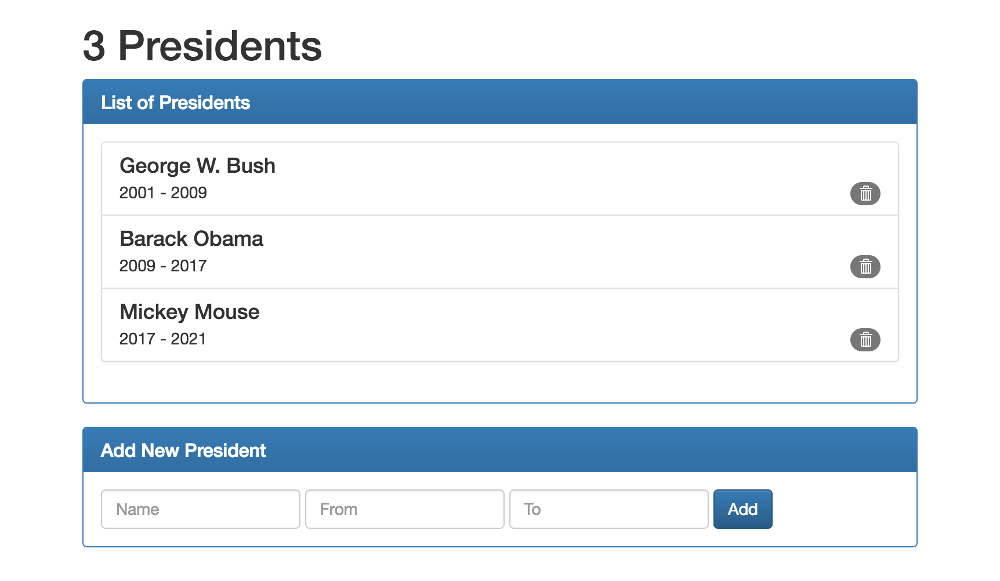

# React: State, Events, Refs

The goal of the previous [Problem Set](https://github.com/gSchool/xp_react_problem_set_2) was to create a [React](https://facebook.github.io/react/) application that renders a static list of presidents, using multiple React components. This repository provides a possible solution as a starting point for the following problem.

## Goals

### Goal 1:

Today's goal is to turn the provided static React application into something useful. Provide the ability to add and remove presidents from the list of presidents, utilizing the `state` of React components:

Remember:

**Properties:** To get data _down_ into a child component, use component properties. To get data _up_ to a parent component, use callbacks passed down as a property. Component `props` are immutable.

**State:** To store state, use the `state` of a component. A component's state is private. No other component can access or modify it.

Do not worry about styling your app at this stage.

### Goal 2:

Work through this [Thinking in React](https://facebook.github.io/react/docs/thinking-in-react.html) article.

### Goal 3:

Use [Bootstrap](http://getbootstrap.com) to style your app (e.g. similar to the Mockup above).

## Stretch Goals

### Stretch Goal 1:

Acceptance test your app using [Protractor](http://www.protractortest.org).

### Stretch Goal 2:

[Test your React components](https://github.com/facebookincubator/create-react-app/blob/master/packages/react-scripts/template/README.md#running-tests) directly.
